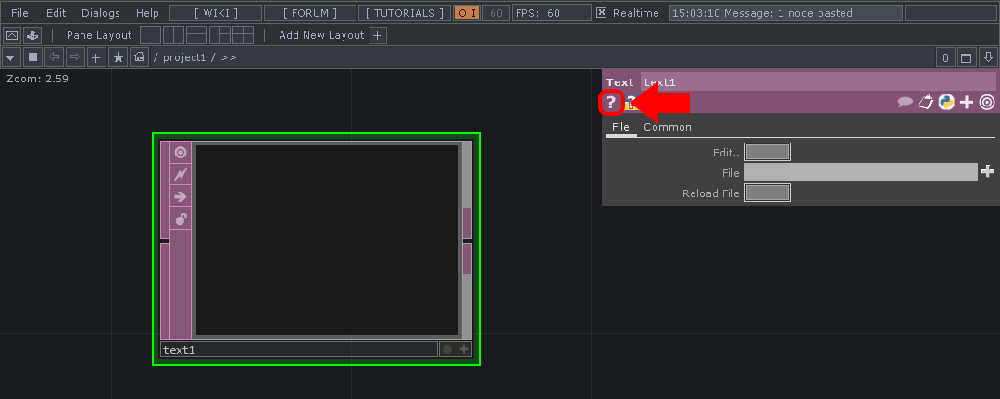
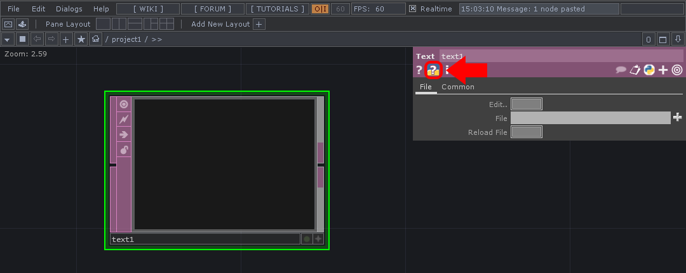

### *1.6 Help*

If there are ever any questions about specific Operators or processes, refer to the official Derivative Wiki. Each Operator has two shortcuts that will open it’s Wiki page in a new browser window. These two buttons are located in the Parameter window, and both are represented by question marks. One is specifically about the Operator and it’s use, while the other, the question mark over the Python logo, is specifically about Python scripting with that Operator.

