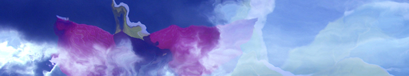
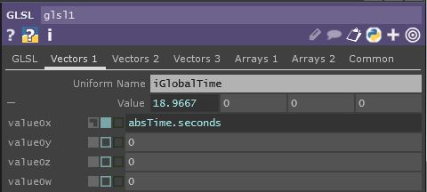
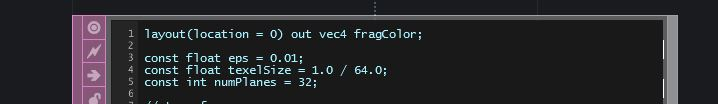
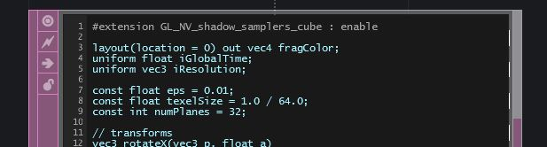
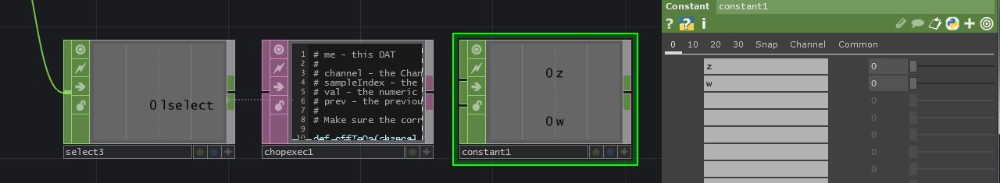

### *12.6 Importing Shaders from Shadertoy*
##### Chapter by Matthew Hedlin

This section will demonstrate the basics of porting a shader from Shadertoy.com to TouchDesigner. We recommend using a feature-rich code editor, such as Sublime Text, Atom, or Notepad++, as there a strong Find-and-Replace function is essential.


#### Shadertoy API
When porting a shader from Shadertoy to TouchDesigner, you can either use your judgement and find/make sources that work similary to the built-in inputs in Shadertoy, or you can download the sources that were used on Shadertoy using their API. To download the shader's input sources, you have to set up a Shadertoy account and create an 'App Key'.

To create an ‘App Key’, once you’re logged into Shadertoy, click on `Profile` at the top right, then click on `your Apps` in the 'Config' section. Choose a name and description, and click the 'Create' button.

You'll see the `App Key` in the 'Manage Your Apps' section. Now, copy this URL `https://www.shadertoy.com/api/v1/shaders/MdlGDM?key=` into your browser, and enter your App Key at the end.

After you press enter, the response will be a JSON object with a key called `inputs`.  In this example, the URL above requires the file called `tex09.jpg`. 

If you enter `https://www.shadertoy.com/presets/tex09.jpg`, as the URL in your browser, you will see and be able to download the required texture.

#### Swizzling
Swizzling is the method of accessing the components of a vector. You'll come across this a few times in these examples. 

If there is a variable `vec4 color`, the 4 values of `color` are represented as `color.rgba`. If you want to access just the first 2 values of the vector you could use `color.rg` If you want to rearrange the values of the vector, you could write `color.bgar`

There are equivalents to .rgba that do the exact same thing, but are generally used in different situations to provide clarity when reading the code. 

In general, when referring to texture coordinates, `.stpq` is used. When referring to 3D coordinates, `.xyzw` are used.

While these conventions do the same thing, they can not be combined. To refer to the four values of `vec4 a` we could use `a.xyzw`, or `a.stpq`, but we could not use `a.stzw` This will create an error.

#### Troubleshooting
A common error encountered when converting Shadertoy shaders is related to the UV extend default. If you find the results of your shader don't match the results on the Shadertoy website, try setting the `Input Extend Mode UV` parameter of the 'GLSL' TOP to `Repeat`.

#### Example 1: Waterly Video - Test


Shader written by: [FabriceNeyret2](https://www.shadertoy.com/user/FabriceNeyret2)

https://www.shadertoy.com/view/MdlGDM 

##### Setup

Start by creating a 'GLSL' TOP and an 'Info' DAT. Put the 'GLSL' TOP's name in the 'Info' DATs `Operator field`.<br>

On the the 'GLSL' TOPs `Common` page, change the `Output Resolution` to `Custom` and then enter `1280` and `720` in the `Resolution` fields.

Copy the code from Shadertoy and paste it into the `glsl1_pixel` DAT, replacing the code that was there by default.

Now we need to set up the sources. For this example, we're just going to create two 'Movie File In' TOPs and select two pictures that are the same resolution as the 'GLSL' TOP (1280 x 720), ‘Mettler.3.jpg’ and 'Trillium.jpg'.

##### Main Function and its Parameters

In Shadertoy, the main function and paramters are:

`mainImage( out vec4 fragColor, in vec2 fragCoord )`

but we'll change that to:

`main()`

To replace the fragColor argument that we removed, we'll go up to the top of the code and insert:

`layout(location = 0) out vec4 fragColor;`

Next, we'll search for all references to `fragCoord` and replace them with `gl_FragCoord`.

`
uniform vec3 Resolution;

uniform float iGlobalTime;
`

##### Uniform Inputs

Shadertoy contains a list of built-in uniform variables. You can view them on the Shadertoy website at the top of the code window by clicking an arrow labled 'Shader Inputs', or you can click the '?' at the bottom right of the same code window to create a pop up window that contains 'Shadertoy Inputs' as well as other information. We will go through the main samplers and uniforms associated with Shadertoy shaders.

##### Samplers
Shadertoy has named their sampler inputs `iChannels`.These samplers can be images, videos, noise patterns, cube mabs, etc. The 'GLSL' TOP has a similar variable called `sTD2DInputs`. The Shadertoy samplers are individual numbered samplers, such as `iChannel0` and `iChannel1`. In TouchDesigner, `sTD2DInputs` is an array, so you can access an elements with a numeric index.

Now, search through the code and wherever there is the a reference to `iChannel0`, replace that with `sTD2DInputs[0]`. Where there is a reference to `iChannel1`, replace that with `sTD2DInputs[1]`.

##### iGlobalTime
To find out what type of uniform this needs to be, look at the list of 'Shader Inputs' on Shadertoy mentioned previously. In the list, `iGlobalTime` is a float, so near the top of our code, below the `fragColor` declaration, we'll write:

`uniform float iGlobalTime;` 

Next, we click on the 'GLSL' TOP in TouchDesigner, and go to the `Vectors 1` page in the parameter window. 

As the first `Uniform Name` we'll write `iGlobalTime` and for the value we will reference TouchDesigner's `seconds` member of the `absTime` class by entering: 

`absTime.seconds`

It should look like this: 




##### iResolution
iResolution is the resolution of the Shader on Shadertoy. If our resolution depended on one of our inputs, we could use TouchDesigner's built-in array of objects: 

`uTD2DInfos[i].res`

In this case you could add `.zw` on the end to retrieve the width and height in pixels, or you can add `.xy` to receive the result of 1.0 divided by the width and 1.0 divded by the height.

For this example, we will manually declare iResolution as a uniform. If we look at Shadertoy's input list, we see that iResolution is a vec3. Similar to iGlobalTime, we'll first declare it in the code by going near the top of our code and writing the line: 

`uniform vec3 iResolution;` 

Next, go to the `Vectors 1` page of the 'GLSL' TOPs parameters, and next to the second `Uniform Name`, enter `iResolution`. For its values, enter `1270` and `720`. We won't need the 3rd value of the vec3 for this, so we'll just leave the other 2 values as `0`

Your GLSL TOP should now compile successfully and look something like this :


#### Example 2: Shard


Shader written by: [simesgreen ](https://www.shadertoy.com/user/simesgreen)

https://www.shadertoy.com/view/Xdf3zM 

This example will take you a bit further, using cubemaps, creating a noise sampler, using sound, and adding mouse interaction.

##### Setup
We will start off with a new TouchDesigner project and begin the same way we did for the last example.

Create a 'GLSL' TOP and set its `Output Resolution` to `1280` and `720`.

Create an 'Info' DAT and add a reference to the 'GLSL' TOP to it’s `Operator` parameter.

Copy the code from Shadertoy into `glsl1_pixel`.

If we look at the shader on the Shadertoy website, at the bottom we can see that we require 3 inputs: a noise texture, a background image, and some sound/audio.

##### Noise Texture
In Shadertoy there are 4 noise textures: a monochrome and color noise at a resolution of 64 x 64, and a monochrome and color noise with a resolution of 256 x 256.

For this example, create a 'Noise' TOP and set the resolution to 64 x 64 in the `Common` settings. We can look at the noise texture on Shadertoy and estimate the settings. These are the settings you can use for now:


##### Background Image
If you click on 'iChannel1' in Shadertoy, you'll see it is a texture from the 'Cubemaps' section. There is a link to the source:

http://www.pauldebevec.com/Probes

Near the bottom of that page, are cube-format images that we can download. The LDR .tif image that matches the one used in the Shadertoy shader is at the bottom right, called `Uffizi.tif`. Download that image.

Create a 'Movie File In' TOP in TouchDesigner and reference the downloaded file.

Connect the new 'Movie File In' TOP to a 'Cube Map' TOP. 

Set the `Input Layout` to `Vertical Cross` and connect the 'Cube Map' TOP to the second input of `glsl1`.


##### Audio
'iChannel2' in Shadertoy is set to a Soundcloud input, but we can use any audio that we'd like, inside of TouchDesigner. For now, we'll just stick with the default audio track in the 'Audio File In' CHOP.

We need to prepare the audio for the 'GLSL' TOP, since we can't directly connect an 'Audio' CHOP to a 'GLSL' TOP. Line 35 of the GLSL code is commented out, stating that you can use this line of code if you don't have audio, but we won't do that. In the next line, the variable `d` is looking for a `texture` with the comment `move planes with music`. The easiest way to achieve a simple version of this is to convert the 'Audio File In' CHOP into a texture.

We only want one sample for this example, so put an 'Analyze' CHOP after the 'Audio File In' CHOP and set the `Function` to `Maximum`. 

We may want to adjust this value later, so put a 'Null' CHOP after that. 

Now create a 'CHOP To' TOP that references the 'Null' CHOP. Set the `Data Format` to `R`.

Connect the 'CHOP To' TOP to the third input of the 'GLSL' TOP.

The network should look like this:


Now that the inputs are set up, we can take a look at the `Info` DAT and see what we'll need to change in the code.

##### Main Function and fragColor
First we'll change the name of the main function from `mainImage` to `main` and remove the parameters, so instead of:

`void mainImage( out vec4 fragColor, in vec2 fragCoord )` 

we should just have: 

`void main()`

Now, we have to replace the 2 parameters we removed from the main function: fragColor, and fragCoord. Go to the very top of the code and insert:

`layout(location = 0) out vec4 fragColor;` 

Now you can search for all references to `fragCoord` (there should only be one, which is in the first line of the main function) and replace it with the built in variable `gl_FragCoord`.

##### Samplers

###### iChannel0
Similar to the last example, iChannel0 is a 2D input, so we'll find all `iChannel0` references and replace them with `sTD2DInputs[0]`. In current versions of GLSL, we don’t need to use a different `texture()` function for different texture types, so use Find-and-Replace to replace all `texture2D` functions to `texture`. `texture2D` will still work, but this is good practice. 



###### iChannel1
Changing the code for iChannel1 is similar to the edits for iChannel0, but the input is a cube map. TouchDesigner sorts the types of inputs for us: 2D, 3D, Cube, etc, into separate arrays. If this was another 2D inputs we would use sTD2DInputs[1], but since it’s a cube map (the first and only in our inputs) we use `sTDCubeInputs[0]`.

As mentioned for `iChannel0`, we don’t need to use separate texture functions, so change all `textureCube` to `texture`. There should be 5 lines of code to change.

If you look at the 'Info' DAT, you'll notice an error has appeared, requiring us to enable `#extension GL_NV_shadow_samplers_cube` :


We can follow its advice, and at the very beginning of our code add: 

`#extension GL_NV_shadow_samplers_cube : enable`

It should look like this:



###### iChannel2
iChannel2 is the audio. We converted the audio information into a 2D texture with the 'CHOP To' TOP. The 'CHOP To' TOP is the 3rd input, but it is the 2nd 2D input, so we'll replace all `iChannel2` references with `sTD2DInputs[1]`, and change the `texture2D` to `texture`. There should only be 1 line to convert.

If you save the shader and look at the 'Info' DAT, you should have fixed all of the errors except for 'iMouse'.

###### iMouse
To find out what we need in order to mimic Shadertoy's iMouse uniform, we need to go back to the Shader Input list. Click the question mark at the bottom right of the window, and if you scroll down, you'll find iMouse:


`iMouse` is a `vec4` with the 4 values defined as:

`xy = current pixel coords (if LMB is down). zw = click pixel`

For now, we'll just set up the uniform with the basics so that the shader renders without errors. Add `iMouse` as a `Uniform Name` to the `Vectors 1` page of the 'GLSL' TOP parameters, and set all the values to `0`. <br>
Now add: 

`uniform vec4 iMouse;`

after the other uniform declarations near the top of the code. 

The 'GLSL' TOP should now be free of errors, and should look something like this:


###### iMouse Functionality
Let's go back to the description of what iMouse does:

`xy = current pixel coords (if LMB is down). zw = click pixel`

We can also see an example of iMouse in action in this shader:

https://www.shadertoy.com/view/Mss3zH.

So `.xy` are the coordinates of the mouse while the LMB is clicked. `.zw` are the coordinates of where the mouse was when it was first clicked. We'll have to set up a little CHOP network to re-create this data.

We could use the 'Mouse In' CHOP, but I'd like to only have the mouse only interact with the shader when it's deliberate.

Create a 'Container' COMP, set the `Width` and `Height` to the same dimensions as the 'GLSL' TOP, which in this case are `1280` and `720`. Set the 'GLSL' TOP as the `Background` of the container in the panel settings. Now make a 'Panel' CHOP and set a reference to your container as the `Component` parameter.

We'll want to select 3 values from the 'Panel' CHOP: `u`, `v`, and `lselect`. To do this, add 3 'Select' CHOPs and connect `panel1` to each one of them in parallel. 

In 'select1', under `Channel Names`, enter `u`. We'll rename right away, so in the `Rename From` field enter `u` and in the `Rename To` field enter `x`. In `select2`, select the `v` channel, and just like before, rename from `v` to `y`. For `select3`, we don't need to rename anything, so just enter `lselect` in the `Channel Names` field.

We'll need to convert these values from 0 - 1 values to the full resolution. Add a 'Math' CHOP after `select1` and set the `Multiply` parameter to `1280`. Add a `Math` CHOP after `select2` and set the `Multiply` parameter to `720`.

Now, create a 'Merge' CHOP and connect `math1` and `math2` to it. As always, add a 'Null' CHOP after that. So far, it should look like this:


Now we have our '.xy' values, so now we need to set up the '.zw' values. We need to read the position of the mouse when the LMB is first clicked, and hold that value until LMB is released.

To do this, create a 'Chop Execute' DAT and set the `CHOP` field to `select3`. Turn the `Off to On` and `On to Off` toggles `on`, and set the `Value Change` toggle to `off`. Add a 'Constant' CHOP to the network and in the first two `Name` fields, create the channels `z` and `w`. This should look like this:



When the LMB is clicked, we want to write the values of `null2` to the`z` and `w` channels of `constant1`, and when it's released, we want to set them back to `0`.

Add the following code snippet to the 'offToOn' function:

```
z = op('null2')['x']
w = op('null2')['y']
op('constant1').par.value0 = z
op('constant1').par.value1 = w
```

And add the following code to the 'onToOff' function:

```
op('constant1').par.value0 = 0
op('constant1').par.value1 = 0
```

You can use another 'Merge' CHOP to merge `constant1` with `null2` and add another 'Null' CHOP after it. Go back to the 'GLSL' TOP and in the four `Value` fields of the `iMouse` uniform, you can reference the `x`, `y`, `z`, and `w` channels of `null3`. You can do this with Python references or exports.

The 'Vectors 1' page should now look like this:


If you view the container, you should now be able to click and drag to rotate around the Shard!<br>

#### Example 3: Cyclic Cellular Automaton


shader written by: [zolozulman](https://www.shadertoy.com/user/zolozulman)

https://www.shadertoy.com/view/4tV3Wd

Shadertoy has implemented the use of multiple buffers, separating functions into separate processes. This example demonstrates one way of importing these multi-pass shaders.

##### Setup
###### Connect the Buffers
On the Shadertoy website, the previous examples only had one tab that contained code called 'Image'. This example has an 'Image' tab as well as a 'Buf A' tab. This means we'll have to use 2 different 'GLSL' TOPs to represent each of the shader functions or `buffers`.

Start by creating those, and setting both TOPs to have the resolution 1280 by 720. Set up an 'Info' DAT for each. Rename the 'GLSL' TOPs to match each buffer so we can keep track of which one is which.

Now we can copy the code from each of the buffers and paste it into the corresponding `GLSL` pixel shaders.<br>
It should look like this:

<br>

###### Noise and Feedback TOP
'iChannel0' for 'Image' is 'Buf A'. This means we can connect the output of our `Buf_A` 'GLSL' TOP, to the first input of our `Image` 'GLSL' TOP. If we click on the Shadertoy tab for 'Buf A' we can see that `iChannel0` is a feedback of itself, `Buffer A`. Before we create that feedback loop, let’s work with `iChannel1`. 'iChannel1' is a noise texture, so we can create a 'Noise' TOP with the same settings as the previous example and connect it to second input of the `Buf_A` 'GLSL' TOP.

   For the feedback loop, we can't connect the output of a top to the input of itself without creating a cook dependancy loop. Add a 'Feedback' TOP in the network. The 'Feedback' TOP needs an input so we can connect the 'Noise' TOP to the input, set the 'Target TOP' parameter to `Buf_A`, then connect the output to the first input of the `Buf_A` 'GLSL' TOP.
   
Our network should look like this:


##### Main Function and fragColor
We'll go through the same process as the previous examples: changing `mainImage` to `main`, removing the parameters inside the `()`, and declaring at the beginning: 

`layout(location = 0) out vec4 fragColor;` 

Next, go through both shaders and change all `fragCoord` references to `gl_FragCoord`. If we look at the 'Info' DATs, we can see an error about data types. That's because the main function call asked for 'vec2 fragCoord' but the built in 'gl_FragCoord' is a vec4.

We'll need to go through the main function, and wherever we find `gl_FragCoord` variable without the `.x` or `.y` after it, we have to add `.xy`. (If you change it in the main function, it will be vec2's that are passed to the other functions, which is what we want). Remember, if the code is referencing 'gl_FragCoord.x' or 'gl_FragCoord.y' then we don't need to change it, since the `.x` and `.y` are selecting the float value from inside the vector already.

This example only has 1 instance in each main function that needs to be changed. The main function for 'Buf_A' should look like this:

```
void main()
{
    float r = pow(iMouse.x-gl_FragCoord.x,2.0) + pow(iMouse.y-gl_FragCoord.y,2.0);
    float max_r = pow(25.0,2.0);
    vec4 c = vec4(0,0,0,1);
    if(r <= max_r){
        c = vec4(1,0,0,1);
    }
    vec2 uv = gl_FragCoord.xy / iResolution.xy;    
    if(iFrame < 5){
        fragColor = texture2D( iChannel1, uv);
    }else{
        fragColor = c+rule(gl_FragCoord.xy);
    }
}
```

and the main function for `Image` should look like this:

```
void main()
{
    vec2 uv = gl_FragCoord.xy / iResolution.xy;
    fragColor = neiborhood(gl_FragCoord.xy)*vec4(uv,0.5+0.5*sin(iGlobalTime),1.0)*4.;
}
```

Now we can go back up to the `Info` DAT and see what else needs to be changed.

##### iResolution, iGlobalTime, iMouse, and iFrame
Both `Buf_A` and `Image` require the declaration of `iResolution` and `iGlobalTime`, which we've done before, so we'll go ahead and add these to both. We need
`
uniform vec3 Resolution;

uniform float iGlobalTime;
`

at the top of both pixel shaders, and we'll need to add both uniforms to the 'Vectors 1' page of the 'GLSL' TOP’s parameters. 

If we look at the `Info` DAT for `Buf_A`, we see a new undefined variable: 'iFrame'.  This uniform is a frame counter and we can either reference `absTime.frame` or `me.time.frame`, depending on whether want the frame counter to loop with the timeline or not. For this example, we use `absTime.frame` as the expression for the first value of the uniform, because we don’t want the looping of timeline to effect the shader.

Next, we can copy and paste the same network we created for iMouse in the previous example, and declare the uniform in the exact same way. 

##### iChannels
The only thing left to convert, is changing any references of `iChannel0` to `sTD2DInputs[0]` and `iChannel1` to `sTD2DInputs[1]`. You can do this for both pixel shaders.

Both of your 'GLSL' TOPs should be working now, and your network might look something like this:

