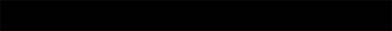

### *3.3 Importing Shaders from Shadertoy*

This section will demonstrate the basics of porting a shader from Shadertoy.com to TouchDesigner. We recommend using a feature-rich code editor, such as Sublime Text, Atom, or Notepad++, as there a strong Find-and-Replace function is essential.
###### Shadertoy API
When porting a shader from Shadertoy to TouchDesigner, you can either use your judgement and find/make sources that work similary to the built-in inputs in Shadertoy, or you can download the sources that were used on Shadertoy using their API. To download the shader's input sources, you have to set up a Shadertoy account and create an 'App Key'. 
To create an ‘App Key’, once you’re logged into Shadertoy, click on `PROFILE` at the top right, then click on 'your Apps' in the 'Config' section. Choose a name and description, and click the 'Create' button. 
You'll see the `App Key` in the `Manage Your Apps` section. Now, copy this URL `https://www.shadertoy.com/api/v1/shaders/MdlGDM?key=` into your browser, and enter your App Key at the end. After you press enter, the response will be a JSON object with a key called 'inputs'.  In this example, the URL above requires the file called 'tex09.jpg’.If you enter `https://www.shadertoy.com/presets/tex09.jpg` as the URL in your browser, you will see and be able to download the required texture.

#### Example 1: Waterly Video - Test
Shader written by: [FabriceNeyret2](https://www.shadertoy.com/user/FabriceNeyret2)
https://www.shadertoy.com/view/MdlGDM

[]

##### Setup
Start by creating a GLSL TOP and an Info DAT. Put the GLSL TOP's name in the Info Dat's ‘Operator field’. Set the GLSL TOP's resolution to `Custom` in 'Common' parameter and enter and then enter 1280 and 720. Copy the code from Shadertoy and paste it into the 'glsl1_pixel' DAT, replacing the code that was there by default.
Now we need to set up the sources. For this example, we're just going to create two ‘Movie File In’ TOPs and select 2 pictures that are the same resolution as the GLSL TOP (1280 x 720), such as one of Peter Mettlers images or 'Trillium'.

##### Main Function and its Parameters
In Shadertoy, the main function and paramters are:
`mainImage( out vec4 fragColor, in vec2 fragCoord )` 
but we'll change that to:
`main()`
withouth the parameters. To replace the fragColor argument that we removed, we'll go up to the top of the code and insert: 
`layout(location = 0) out vec4 fragColor;` 
Next, we'll search for all references to `fragCoord` and replace them with `gl_FragCoord`.

```
uniform vec3 Resolution;
uniform float iGlobalTime
``` 

