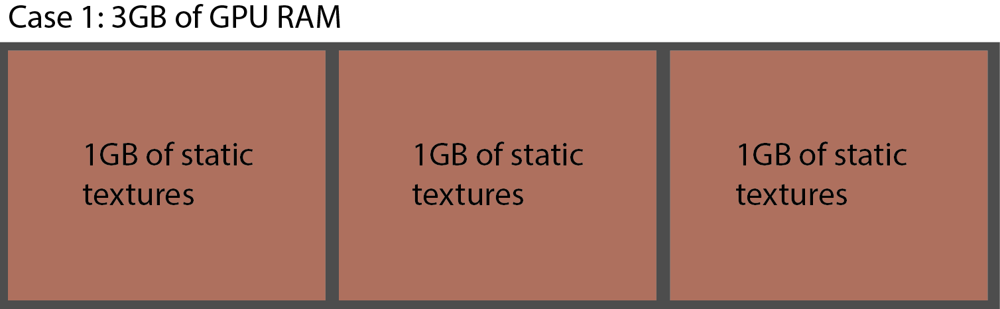

### *11.6 GPU Memory Fragmentation*

Operators that use the GPU will often allocate the resources required for their tasks, and hold onto them until the task has been completed or changed.

GPU Fragmentation is one of the main concerns when working working with projects that have many different content sources. For example, a Constant TOP with a resolution of 1280x720 is connected to 10 other Operators. Once connected and cooked, each Operator will set aside the proper amount of GPU memory required to handle the processing of its specific amount of pixels. Once the memory is allocated, the Operators can operate relatively efficiently within their allocated space.

If the resolution of the source Constant TOP is changed, this will trigger a chain reaction, where all of the 10 other Operators will have to reallocate the correct amount of GPU resources for their tasks. If the Operator's resources are reallocated efficiently, many of the same memory blocks will be reused. If on the off-chance they can't reuse memory blocks, they'll have to relocate to the end of the memory. If this happens enough times in quick succession, the GPU memory will be fragmented, leaving the project in a state of poor performance while the GPU tries to defragment its memory.

The two diagrams below try to outline memory fragmentation in the simplest way possible.

There are two case studies, both with similar parameters: There are 3GB of GPU RAM and there are three 1GB static textures to load and hold in RAM indefinitely.

In Case 1, the 3GB GPU of RAM would be able to perfectly fit the three 1GB static textures. They are called static textures because once they've allocated to memory, they aren't changed. This is the equivalent to loading a large image into a Movie In TOP at the start of a project and leaving it there indefinitely.

This is a perfect world situation, as there are many other processes that use GPU RAM, meaning resources are constantly in flux, and there would never be 3GB of free RAM on a graphics card that only has 3GB of GPU RAM.

Case 2 describes a situation where memory fragmentation will occur. To the already existing three 1GB textures, a 200MB texture is added to the mix. In this example, the loading and unloading is to happen in the following order:

1. Load 1GB texture

2. Load 200MB texture

3. Load 1GB texture

4. Unload 200MB texture

5. Load 1GB texture

This would simulate a situation where a texture is loaded, displayed, and then replaced with another texture. 

{width=100%}

In diagram 'Case 2.1', Steps 1 through 3 are completed, and there is 800MB free. At first glance, this might seem perfect, because if the 200MB texture is unloaded, there would be 1GB of free space for the final texture. Unfortunately, this isn't how graphics cards work.

{width=100%}

As seen above, in diagram 'Case 2.2', Step 4 has been completed, and the 200MB texture has been unloaded. What remains is a prime example of GPU memory fragmentation. There is a total of 1GB of free GPU memory, but there isn't a single block of 1GB to allocate to the 1GB texture. The already-loaded 1GB textures, in their static state, can't be shifted in the GPU memory without a full unload and reload process occurring, and because the memory can't be shifted, the 200MB of free space has been trapped between the static textures. This 200MB allocation can be filled with 200MB or smaller textures, but it will not be able to load the third 1GB static texture.

The best way to prevent heavy memory fragmentation is to try to and restrict the amount of varying resolutions in a project. When an asset is swapped out for one that is the same resolution, often times it can take its place in the memory.

{pagebreak}
