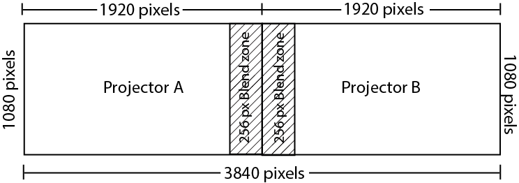

### *10.5 Edge Blending*

Video projectors are an incredibly flexible and are able to create infinitely large canvases. This is done by creating arrays of projectors with overlapping edges that are blended together to create a seamless canvas. This act of blending the overlapping sections is called 'Edge blending'.

The idea of edge blending might be new to those who generally work with monitors and screen arrays. A great example of the principles behind edge blending can be done relatively quickly. Set up 2 projectors and have one project the color blue and have the other project the color green. Separately, these projectors output their assigned colors, but if you aim the projectors so that the colors overlap, the areas where these two projectors overlap you will actually have a turquoise color. These principles of physics and additive color mixing are the basis for edge blending.

There is an excellent paper written by Paul Bourke that goes much more in-depth on the subject of edge blending than we will be going here. For further reference and reading, please find that paper at the link below:

**Edge blending using commodity projectors by Paul Bourke** [http://paulbourke.net/texture_colour/edgeblend/](http://paulbourke.net/texture_colour/edgeblend/)

The best way to learn the basics of edge blending is through an example setup. In this example, the goal will be to blend two 1920 x 1080 projectors in a 1 x 2 array (1 unit tall and 2 units across). Below is a diagram of a 1 x 2 array of projectors:

{width=100%}

The act of blending both of these projectors will require an overlapping section. The amount of overlap needed will vary based on many factors such as projector resolution and installation parameters. Starting with a blend zone that is a power of 2 close to 10\% of your single projector size can be a good place to start experimenting. For this example, 10\% of the length of a 1920 x 1080 screen is 192 pixels, and the nearest power of 2 is 256. 

This overlapping section can cause problems if all of its implications aren't considered. For the image to overlap, that means the both projectors must have the same content on their blending edges. In this example, that means that the right edge of Projector A and the left edge of Projector B must have the exact same content. Filling in some numbers, that means that the 256 pixels on the right edge of Projector A must be the same as the 256 pixels on the left edge of Projector B, as per the diagram below:

{width=100%}

It's important to take this fact into consideration in regards to the full production pipeline and workflow. It seems natural at first to think that a 1 x 2 array of 1920 x 1080 projectors would need content created at 3840 x 1080, but that assumption can lead undesirable consequences.

A projector has a set amount of physical pixels just like a monitor. Two 1920 x 1080 images placed edge to edge will have a span of 3840 pixels, but if pixels need to be doubled in the overlapping blend zone, those extra pixels used for blending don't appear from thin air. The blend zone will need to consume pixels that would have otherwise been used for content. 

In this example, if the content creation team created a 3840 x 1080 asset, 256 pixels would need to be discarded from somewhere to account for the 256 pixels that are going to be doubled in the blend zone. Where these pixels are discarded from is a matter of preference and tool choice, but the preferred method is to discard half of the blend zone from each non-blended edges opposite the blend zone. This method keeps the absolute center of the canvas the area where blending will occur, as per the diagram below:

{width=100%}

Always be aware of this loss of pixels when edge blending projectors to avoid placing critical information or content around areas where pixels may be discarded. So why remove only half the blend zone (128 pixels) on each side and not remove the whole blend zone from each side (256 pixels)? The answer is that to create an overlap of 256 pixels in the center, each side needs to be shifted 128 pixels towards the other. When both sides are moved 128 pixels towards each other, the resulting overlap is 256 pixels.

Before proceeding with edge blending in TouchDesigner, there are a few ways to approach creating content for blended projectors. 

The first is to create content at the full output resolution, in this example that would be 3840 x 1080, with a buffer of content around the edges where pixels will be discarded. Even though parts of the buffer will be discarded, it allows for a bit of flexibility in changing the size of the blend zone during installation and setup without worrying about cutting too much content and not having enough to fill the canvas. This is the 'safe' way to proceed for projects that don't have an experienced projectionist on staff to calculate the blend zones before installation.

For projects that do have a projectionist or other experienced individual on staff, there is the option to have the content team create content to the size of your visible image, and not the full output resolution. This is appealing because it means that there are less pixels to process in generative pipelines or pixels to read from a hard drive. To calculate the total image size in this example, take the full output resolution (3840 x 1080) and subtract the size of the blend zone (256 pixels). This leaves 3584 x 1080 for content, or the image resolution. The risk exists with this method that if the blend zones aren't calculated correctly, then the content may not be large enough to fill the screen without additional scaling.

Whichever route is chosen, the diagrams below illustrate firstly the final output of each projector side by side as seen by Windows and TouchDesigner, and secondly the projected image as seen on the projection surface after the blending.

{width=100%}

{width=100%}

Implementing this example is straightforward in TouchDesigner thanks to built-in edge blending tools. Before using the built-in edge blending component, let's take a look at the base elements of an edge blending workflow in a simple example.

Open example 'Simple\_blend.toe'. In this example, the Container COMP named 'content', creates stand-in 3840 x 1080 content by stretching a TouchDesigner sample file. The output of this container is then split into two parts using Crop TOPs, one for each projector. The important thing to note here is the offset mentioned previously is in the Crop TOPs. Projector A's Crop TOP creates a 1920 x 1080 (projector resolution) texture starting from the left edge that is offset 128 pixels to the right, discarding 128 pixels (half the size of the blend zone) from the non-blended edge, in this case, the left edge. Similarly, Projector B's Crop TOP creates a 1920 x 1080 texture starting from the right edge that is offset 128 pixels to the left, discarding 128 pixels from the non-blended edge, in this case, the right edge. Both textures being offset by 128 pixels towards each other creates a 256 pixel overlap for blending. 

To create the blend zone, these textures are multiplied by alpha ramps that are the size of the blend zone, which is 256 x 1080 pixels. There are a number of other elements needed to create a seamless image, but this example is to demonstrate the workflow. After the elements have their edges prepared for blending, they can be appropriately composited onto a single texture that is the full output resolution, or in this case, the individual textures are then assigned to the backgrounds of Container COMPs, each at the projector resolution. These Container COMPs are then parented and aligned using the parent container's 'Align Layout Horizontal Left To Right' parameter, which effectively creates the master output.

There are a few elements missing from this basic example such as gamma and luminance correction, but this should give you an example of the process of cropping the source texture, offsetting the pieces to create an overlap, creating the blend zone using a ramp, and then creating an output from that. With a basic understanding of the workflow, let's take a look at an example using the more feature-rich built-in edge blending tool.

Open example 'Full\_blend.toe'. This project file has two examples in it corresponding to the two methods of content creation that were discussed. To find the edge blending component for your own projects, open the Palette Browser either using 'Alt + L' or by going to the 'Dialogue' menu at the top of the screen and clicking on 'Palette Browser'. Inside the Palette Browser, under the 'Tools' section, you will find the 'EdgeBlend' component that can be dragged into your project. This component is based on the same paper by Paul Bourke referenced earlier.

In both examples, the 'EdgeBlend' component is set to have a blend of 256 pixels. The 'EdgeBlend' component creates an overlap of content in the center of the texture, at the expense of discarding pixels on the non-blended edges. It multiplies the blended edges by a ramp and composites the processed textures onto a canvas that is the full projector resolution.

The first example uses stand-in content at the full output resolution of 3840 x 1080 pixels. This is the 'safe' method mentioned earlier where losing extraneous content on the non-blended edges allows a bit more flexibility in blend zone adjustments during installation.

The second example uses stand-in content at the image resolution of 3584 x 1080. At this resolution, pixels don't need to be discarded from this texture. One key thing to remember is that many edge blending tools will assume that you are using the first example's route, providing content at the full output resolution and they will discard pixels on the outside edges and return a texture at the same resolution as your input texture. That is why in this example, the image resolution asset (3584 x 1080) is composited in the center of a full output resolution canvas (3840 x 1080) before being input into the 'EdgeBlend' component. Thus the 'EdgeBlend' component will double content in the middle and discard the blank space on either side of the image.

The difference of outputs can be seen clearly, whereas the top example loses the reference color bars that were on the outside edges of the image, and the second example does not.

With these outputs prepared, it's a matter of sending the correct texture to the correct projector. How to rig projectors and work with complex rigs is outside of the scope of this chapter. In an ideal situation, both projectors are parallel with the projection surface as such:

{width=100%}

If the amount of pixels in the blend zone are already known, input them into the 'Region' parameter of the 'EdgeBlend' component. Then try turning off the 'Enable Blend' button to make sure your image is correctly overlapping. At this point, the overlapped images should match and be lined up. Always remember the main purpose of an edge blending tool is to remove the seams, not line up the content.

If the amount of pixels in the blend zone aren't know, turn off the 'Enable Blend' button and enter a guess. Trying a lower value in the 'Region' parameter will offset each projector's texture towards the center, while a higher value will offset them towards the edges. Continue increasing or decreasing the 'Region' value until your the content in the overlap is the same. Then turn on the 'Enable Blend' button.

At this point, use the 'Blend' slider to adjust power of the blend. A higher value will make the ramp steeper, whereas a lower value will create a more gradual ramp.

You may need to perform gamma correction on the contents of the blend zone. This is because light isn't perceived linearly, so the luminance of a pixel being input at 0.5 might not be double that of brightness of a pixel being input at 0.25 (pixel values being normalized from 0-1). Almost all video data already passes through gamma correction but because of the variance of projector technologies and the fact that there are two projectors overlapping, you may find subtle changes need to be made. These sliders are used to compensate or lessen the intensity of the gamma correction.

The 'Luminance' slider controls the overall luminance of the blend zone. If the blend zone is brighter or darker than the rest of image, bringing this slider below 0.5 will make the blend zone darker, while raising this slider above 0.5 will brighten the blend zone.

{pagebreak}