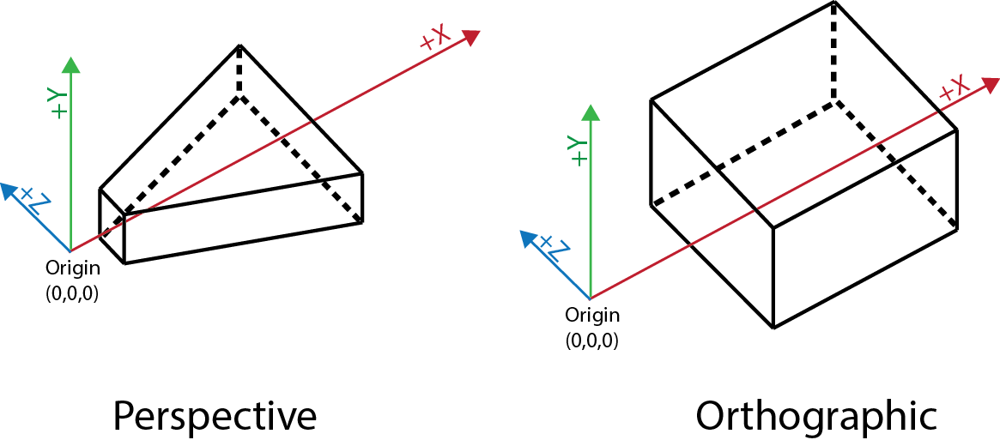

### *6.2 Rendering*

One thing many beginners struggle with is the process of quickly and effectively transitioning from a 3D workflow to a 2D workflow. The Internet is full of 3D workflow tutorials that can explain many of the finer points of 3D rendering, but for this chapter, the goal is to get from point A, a simple 3D object, to Point B, a Render TOP.

There are three parts to a 3D scene:

1. 3D geometry (and materials)

1. Camera

1. Lighting

Open example 'Rendering\_1.toe'. Taking a quick look at it, there are three basic things needed to render the scene, Camera, Light, and 3D geometry, which are all referenced by a Render TOP. Let's break down each aspect of the render setup, and then look at how it all fits together.

The appropriate place to begin is the 3D geometry. This is the essence of it all. The 3D model can be anything from simple polygons, animated 3D characters, architectural models, etc. Whether importing or procedurally building models, all of the operations are done with SOPs, and these SOPs end up in a Geometry Component. A key idea to grasp is that in TouchDesigner, SOPs themselves are never directly rendered. Instead, Geometry Components, or Geometry COMPs, are rendered, that hold SOPs that are flagged for rendering. This is a crucial idea to understand. Two scenarios demonstrate this.

Open example 'Rendering\_2.toe'. In this project, there is a single geometry that is sent into 4 different Geometry COMPs, each of which is rendered with different transform values. For the sake of example, this project uses a Box SOP, but in this could apply to more complex models. Performing operations on a complex character, and having a few iterations of it, could max out a systems headroom. Going back to the idea that SOPs aren't directly rendered, it becomes logical to load the model once, from which a few iterations can be housed and rendered from Geometry COMPs.

Open example 'Rendering\_3.toe'. This is very different than the previous example, in that there is a single Geometry COMP with 3 different models that are being rendered. Keeping in mind that Geometry COMPs are rendered, it becomes logical to group these models into a single Geometry COMP, that is being rendered. The difference may seem arbitrary, but as projects become more complex, saving resources becomes paramount.

Till now, the various geometry haven't had any materials. Materials are what make 3D scenes interesting. The difference between a cement building-block and a 3D box is a material. Textures can be applied at two levels: the SOP level, and the Component level. The first is through the use of the Material SOP, and the second is by referencing the material in the 'Render' tab of a Geometry COMP. In the example 'Rendering\_4.toe', both materials look the same, but each use a different method of texturing.

Now that materials are added to the mix, let's quickly discuss UV maps. Open example 'Rendering\_5.toe'. This is the same example as above, but the same texture looks completely different. This is because the co-ordinates of the UV map have been changed.

The second aspect of a 3D scene is light. Just as in real life, 3D scenes require lighting. Open example 'Rendering\_6.toe'. This example has a simple box being rendered, but nothing is visible in the Render TOP. This is because the light's dimness has been purposefully set the to 0, to demonstrate how important lighting is, and how it is often overlooked.

The next few example projects are the same scene with different lights. In each consecutive project, the Light COMP has been transformed to light the Box SOP from a different angle. These are example projects 'Rendering\_7.toe', 'Rendering\_8.toe', and 'Rendering\_9.toe'.

The last aspect to rendering a 3D scene is the camera. The camera is the eye and perspective. What the camera sees is what gets rendered. Open example 'Rendering\_10.toe'. All the movement in the scene stems from the animated camera movements. Often times, a camera is placed in a scene and never thought about again. This can lead to boring 3D scenes that feel very static and lifeless. Don't be afraid to think like a cinematographer, and experiment with camera positions, focal lengths, and animated camera movement.

There are two main types of cameras: perspective cameras and orthographic cameras.

Perspective cameras need very little explanation, as they work similarly to the human eye. Perspective cameras have a perspective point, and a view frustum that are used to determine what the camera sees and how that is rendered. With a perspective camera, imagine all light in the 3D scene funnelling towards the perspective point. Perspective correction, or 'foreshortening', is applied on all objects in the scene, meaning that objects farther away from the camera appear smaller. This camera ends up being used most often as it functions like human eyes. An example of this type of camera can be found in example file 'Camera\_1.toe'.

This example highlights perspective correction. There are two cubes, both the same size. The cube placed farther in the scene appears smaller, just as it would in real life. This is the simplest example of how a perspective camera functions.

Orthographic cameras, on the other hand, are very different. Those familiar with computer-aided design (CAD) software, may have encountered orthographic cameras before. The key principle behind an orthographic camera is that there is no single point of perspective. All of the light in the imaginary 3D scene would not filter into a single point, as in a perspective camera. Objects are not distorted by their Z position in space, meaning that no matter how far away from the camera an object is, it will appear no bigger or smaller than the other objects in the scene. 

Open example 'Camera\_2.toe'. This example is exactly the same as 'Camera\_1.toe', but there is a big difference in what is being rendered. In this example, the two cubes appear to be side by side, regardless of positioning in Z space. This can be a hard concept to understand the first time it is presented. Two ways of thinking about it are as follows:

**First** The concept of a 3D world that gets squashed onto a single plane before it gets rendered. Imagine the original Super Mario video game actually being a 3D scene that was rendered using an orthographic camera. No matter where bad guys and platforms are on the screen, whether at the edge or in the middle, they are always the same size and shape, and have no perspective correction applied. 
**Second** Think about the blueprint of a building in a CAD program. It is a representation of a 3D object on a 2D plane. No matter where the blueprint is perceived from on screen, 1 unit of measurement on the edge of the screen is exactly the same length as 1 unit of measurement in the middle of the screen. Any change in the camera positioning doesn't distort what is being rendered.

None of this is to say that Z-depth is irrelevant when using an orthographic camera. Z depth becomes imperative when layering different pieces of geometry in a scene. 

The camera is equally important for projection mapping projects. Projection mapping will be explored in later examples, but for now, the key is to understand another of the Camera's roles. In projection mapping, the primary goal is to turn real-world objects into 3D display surfaces. To achieve this, a 3D model of the object is imported into TouchDesigner and textured using a variety of sources. This textured object then needs to be rendered. Camera COMPs come into play to simulate real-world projectors. Gathering as much information about the characteristics of a projector and it's lens, the Camera COMP can accurately replicate the point of view of the projector inside of TouchDesigner. These points of view are then rendered, output, calibrated, and lined up to the real-world object. This is the basis of projection mapping.
