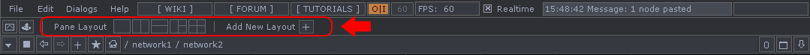

## *2.5 Panes*

Using panes regularly can save a ton of time when moving back and forth between Networks. Having to travel through 3 Networks to change a parameter, only to have to travel back to see the changes is a waste of time. Panes take the current window, split it horizontally or vertically as many times as desired. Each pane layout can be saved for later use. 

The diagram above highlights the pane presets that are available by default. The presets provide quick access to a few standard configurations of panes including split left and right, split top and bottom, a 3 pane setup, and a 4 pane setup. Saving pane presets is as easy as clicking the 'Add New Layout +' button, entering a name, and clicking 'Ok'. Saving a layout not only saves the size and position of the panes, but also saves each pane's type. 

Panes are able to display unique types of content, whether they are other dialogs, Networks, or viewers. Being able to mix and match combinations of viewers and Network editors allows for a lot of flexibility. In the diagram below, the top left pane is a Network editor. On the right-hand side, is a Textport, and on the bottom-left, there is a Geometry Viewer. Again, saving this layout would not only save the pane arrangement, but also the pane types. This is useful when working on a project with a lot of different elements, where jumping between something like the setup above, and a simple Network editor, can save quite a bit of time in the long run.

The keyboard shortcuts for working with panes are as follows:

1. Alt + [ : Vertically split current pane under mouse

1. Alt + ] : Horizontally split current pane under mouse

1. Alt + Z : close pane under mouse
